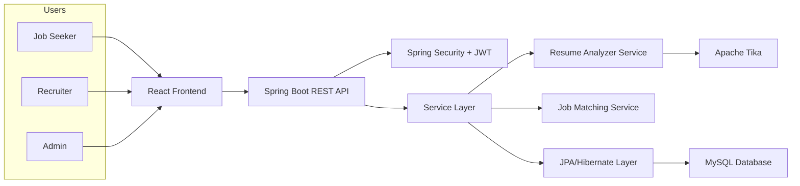

# Smart Job Portal with Resume Analyzer

## 1. Project Architecture Diagram



## Architecture Notes

- `React Frontend` handles login, registration, job browsing, recruiter dashboard, and resume upload.
- `Spring Boot REST API` exposes endpoints for authentication, jobs, applications, resumes, and recommendations.
- `Spring Security + JWT` protects APIs and applies role-based authorization for `USER`, `RECRUITER`, and `ADMIN`.
- `Service Layer` contains business rules so controllers stay thin and repositories stay focused on database access.
- `Resume Analyzer Service` uses Apache Tika to parse PDF/DOC/DOCX files and then extracts skills using keyword matching.
- `Job Matching Service` compares extracted candidate skills with required job skills and calculates a match score.
- `MySQL` stores users, jobs, resumes, applications, and normalized skill mappings for performance and reporting.

## Backend Folder Structure

```text
backend/
  pom.xml
  src/main/java/com/smartjobportal/
    config/
    controller/
    dto/
    exception/
    model/
    repository/
    security/
    service/
    support/
  src/main/resources/
    application.yml
    application-dev.yml
```
